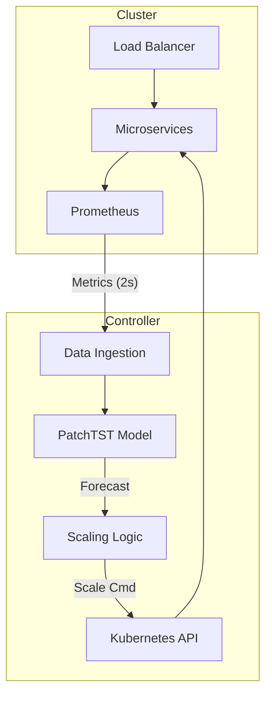

# Proactive Kubernetes Autoscaling Using Patch-Based Transformer Models

[](https://opensource.org/licenses/MIT)
[](https://ieeexplore.ieee.org/xpl/conhome/1000147/all-proceedings)

This repository contains the implementation, datasets, and analysis scripts for the research paper: **"Proactive Kubernetes Autoscaling Using Patch-Based Transformer Models for Latency-Sensitive Microservices"**.

## 📖 Abstract

Kubernetes Horizontal Pod Autoscaler (HPA) primarily employs a reactive feedback loop that scales services only after resource thresholds are exceeded. Under bursty workloads, this reactive delay leads to significant latency spikes and SLO violations. 

We propose a proactive predictive framework that augments the native Kubernetes HPA with **PatchTST**, a state-of-the-art patch-based Transformer architecture. Our model forecasts demand surges 45–60 seconds before they occur, enabling pre-emptive resource provisioning. Experimental results on a live **Google Kubernetes Engine (GKE)** cluster demonstrate a **78.9% reduction in P95 latency** and effective **zero-shot transfer learning** across distinct microservice architectures.

## 🏗️ System Architecture

The framework operates as an external control loop that intercepts Prometheus metrics and issues scaling commands via the Kubernetes API.



## 🚀 Key Features

- **PatchTST Implementation**: Leverages subseries patching and channel independence for robust time-series forecasting.
- **High-Fidelity Dataset**: Includes 35,000+ temporally aligned observations from real-world GKE deployments (Online Boutique & Sock Shop).
- **Proactive Controller**: A Python-based external controller that bypasses HPA's conservative evaluation windows.
- **Zero-Shot Transfer**: Models trained on one microservice architecture generalize effectively to unseen environments.

## 📊 Experimental Results

| Metric | Standard HPA | Proactive Framework | Improvement |
| :--- | :--- | :--- | :--- |
| **Peak P95 Latency** | 1,020 ms | **215 ms** | **78.9%** |
| **Prediction RMSE** | 0.7821 | **0.0179** | **97.7%** |
| **Resource Savings** | Baseline | **13.5%** | --- |

## 🛠️ Setup & Usage

### Prerequisites
- Python 3.9+
- Kubernetes Cluster (GKE recommended)
- Prometheus installed in-cluster
- `gh` CLI (for repository management)

### Installation
1. Clone the repository:
   ```bash
   git clone https://github.com/Dhruv2605/proactive-k8s-autoscaling-patchtst.git
   cd proactive-k8s-autoscaling-patchtst
   ```
2. Install dependencies:
   ```bash
   pip install -r requirements.txt
   ```

### Running the Controller
To start the proactive autoscaling loop:
```bash
python automation_n5.py
```

## 📂 Repository Structure

- `ic2e_paper.tex`: Main LaTeX manuscript.
- `Datasets/`: High-fidelity CSV datasets for Online Boutique and Sock Shop.
- `Results/`: Visualization scripts and generated plots.
- `*.py`: Core logic for data collection, model training, and scaling control.

## 📜 Citation

If you use this work in your research, please cite:

```bibtex
@inproceedings{bhogaonkar2026proactive,
  title={Proactive Kubernetes Autoscaling Using Patch-Based Transformer Models for Latency-Sensitive Microservices},
  author={Bhogaonkar, Dhruv and Mukherjea, Sougata},
  booktitle={2026 IEEE International Conference on Cloud Engineering (IC2E)},
  year={2026}
}
```

## 📄 License

This project is licensed under the MIT License - see the [LICENSE](LICENSE) file for details.
